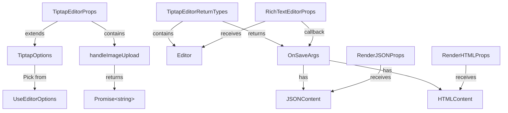

import { Tabs } from "nextra/components";

# Types & Interfaces

Complete reference for all TypeScript types and interfaces used throughout the Tiptap React UI library.

## Editor Configuration Types

### `TiptapOptions`

Core configuration options passed directly to the Tiptap `useEditor` hook.

```typescript
type TiptapOptions = Pick<
  UseEditorOptions,
  | "autofocus"
  | "content"
  | "coreExtensionOptions"
  | "editable"
  | "element"
  | "emitContentError"
  | "enableContentCheck"
  | "enableCoreExtensions"
  | "enableExtensionDispatchTransaction"
  | "enableInputRules"
  | "enablePasteRules"
  | "immediatelyRender"
  | "injectCSS"
  | "injectNonce"
  | "onBeforeCreate"
  | "onBlur"
  | "onContentError"
  | "onCreate"
  | "onDelete"
  | "onDestroy"
  | "onDrop"
  | "onFocus"
  | "onMount"
  | "onPaste"
  | "onSelectionUpdate"
  | "onTransaction"
  | "onUnmount"
  | "onUpdate"
  | "parseOptions"
  | "shouldRerenderOnTransaction"
  | "textDirection"
  | "editorProps"
>;
```

**Description**: A subset of Tiptap's `UseEditorOptions` type that provides all the configuration options available for creating and customizing the editor instance.

---

### `TiptapEditorProps`

Props for the `useTiptapEditor` hook and editor component.

```typescript
type TiptapEditorProps = {
  isPreview?: boolean;
  handleImageUpload?: {
    onUpload?: (
      file: File,
      onProgress?: (event: { progress: number }) => void,
      abortSignal?: AbortSignal,
    ) => Promise<string>;
    maxLimit?: number;
    limit?: number;
  };
  className?: string;
} & TiptapOptions;
```

**Properties**:

| Property                     | Type       | Default                          | Description                              |
| ---------------------------- | ---------- | -------------------------------- | ---------------------------------------- |
| `isPreview`                  | `boolean`  | `false`                          | Enables preview mode (read-only display) |
| `className`                  | `string`   | `"max-h-[60vh] overflow-y-auto"` | Custom classes for the editor element    |
| `handleImageUpload`          | `object`   | -                                | Configuration for image uploads          |
| `handleImageUpload.onUpload` | `Function` | -                                | Upload handler function                  |
| `handleImageUpload.maxLimit` | `number`   | -                                | Max file size in megabytes                   |
| `handleImageUpload.limit`    | `number`   | -                                | Max number of images                     |

**Example**:

```typescript
const props: TiptapEditorProps = {
  content: "<p>Start editing...</p>",
  isPreview: false,
  className: "h-96 p-4 border rounded",
  autofocus: "end",
  handleImageUpload: {
    onUpload: async (file) => "/url/to/image.jpg",
    maxLimit: 5,
    limit: 10,
  },
};
```

---

## Hook Return Types

### `TiptapEditorReturnTypes`

Return value of the `useTiptapEditor` hook.

```typescript
type TiptapEditorReturnTypes = {
  editor: Editor;
  getEditorContent: () => {
    json: JSONContent | null;
    html: string | null;
  };
};
```

**Properties**:

| Property           | Type       | Description                                              |
| ------------------ | ---------- | -------------------------------------------------------- |
| `editor`           | `Editor`   | The Tiptap editor instance (can be null during mount)    |
| `getEditorContent` | `Function` | Function to get current content in JSON and HTML formats |

**Example**:

```typescript
const { editor, getEditorContent } = useTiptapEditor();

if (editor) {
  const { json, html } = getEditorContent();
  console.log(json, html);
}
```

---

## Component Props Types

### `RichTextEditorProps`

Props for the `RichTextEditor` component wrapper.

```typescript
type RichTextEditorProps = {
  editor: Editor;
  onSave?: (val: OnSaveArgs) => void;
  enablePreview?: boolean;
  enableWordCount?: boolean;
  immediatelyRenderPreview?: boolean;
  className?: string;
};
```

**Properties**:

| Property                   | Type       | Default | Description                                       |
| -------------------------- | ---------- | ------- | ------------------------------------------------- |
| `editor`                   | `Editor`   | -       | Tiptap editor instance (required)                 |
| `onSave`                   | `Function` | -       | Callback when save button is clicked              |
| `enablePreview`            | `boolean`  | `false` | Show preview alongside editor                     |
| `enableWordCount`          | `boolean`  | `true`  | Display word/character count in footer            |
| `immediatelyRenderPreview` | `boolean`  | `true`  | Render preview immediately (set to false for SSR) |
| `className`                | `string`   | -       | Custom classes for outer container                |

**Example**:

```typescript
<RichTextEditor
  editor={editor}
  enablePreview={true}
  enableWordCount={true}
  onSave={(content) => {
    console.log('Saving:', content.json, content.html);
  }}
  className="max-w-4xl mx-auto"
/>
```

---

### `RenderJSONProps`

Props for the `RenderJSON` component.

```typescript
type RenderJSONProps = {
  content: JSONContent;
  immediatelyRender?: boolean;
  contentClassName?: string;
  editorsClassName?: string;
  _height?: number;
};
```

**Properties**:

| Property            | Type          | Default | Description                           |
| ------------------- | ------------- | ------- | ------------------------------------- |
| `content`           | `JSONContent` | -       | Tiptap JSON document (required)       |
| `immediatelyRender` | `boolean`     | `true`  | Render immediately (false for SSR)    |
| `contentClassName`  | `string`      | -       | Classes for rendered output container |
| `editorsClassName`  | `string`      | -       | Classes for editor element            |
| `_height`           | `number`      | -       | Optional height in pixels             |

**Example**:

```typescript
const json = editor.getJSON();

<RenderJSON
  content={json}
  immediatelyRender={typeof window !== 'undefined'}
  contentClassName="prose prose-sm dark:prose-invert"
/>
```

---

### `RenderHTMLProps`

Props for the `RenderHTML` component.

```typescript
type RenderHTMLProps = {
  content: HTMLContent;
  className?: string;
  sanitize?: (html: string) => string;
};
```

**Properties**:

| Property    | Type          | Default | Description                                     |
| ----------- | ------------- | ------- | ----------------------------------------------- |
| `content`   | `HTMLContent` | -       | HTML string from editor (required)              |
| `className` | `string`      | -       | Custom classes for wrapper element              |
| `sanitize`  | `Function`    | -       | HTML sanitization function (for XSS prevention) |

**Example**:

```typescript
import DOMPurify from 'isomorphic-dompurify';

const html = editor.getHTML();

<RenderHTML
  content={html}
  className="prose prose-lg"
  sanitize={(html) => DOMPurify.sanitize(html)}
/>
```

---

## Content & Callback Types

### `OnSaveArgs`

Callback argument passed to `onSave` in `RichTextEditor`.

```typescript
type OnSaveArgs = {
  json: JSONContent;
  html: string;
};
```

**Properties**:

| Property | Type          | Description                         |
| -------- | ------------- | ----------------------------------- |
| `json`   | `JSONContent` | Tiptap JSON document representation |
| `html`   | `string`      | Serialized HTML string              |

**Example**:

```typescript
const handleSave = (args: OnSaveArgs) => {
  console.log('JSON:', args.json);
  console.log('HTML:', args.html);

  // Send to API
  fetch('/api/documents', {
    method: 'POST',
    body: JSON.stringify(args),
  });
};

<RichTextEditor editor={editor} onSave={handleSave} />
```

---

## Tiptap Core Types

### `Editor`

Tiptap editor instance. Imported from `@tiptap/core`.

```typescript
import { Editor } from "@tiptap/core";
```

**Common Methods**:

```typescript
editor.getJSON(); // Get content as Tiptap JSON
editor.getHTML(); // Get content as HTML string
editor.setContent(content); // Set editor content
editor.isActive(mark); // Check if mark is active
editor.chain(); // Create transaction chain
editor.view; // Access ProseMirror view
editor.state; // Access editor state
```

---

### `JSONContent`

Tiptap's internal JSON representation of editor content.

```typescript
import { JSONContent } from "@tiptap/core";
```

**Structure Example**:

```typescript
{
  type: "doc",
  content: [
    {
      type: "paragraph",
      content: [
        { type: "text", text: "Hello world" }
      ]
    },
    {
      type: "codeBlock",
      attrs: { language: "javascript" },
      content: [
        { type: "text", text: "const x = 1;" }
      ]
    }
  ]
}
```

---

### `HTMLContent`

Simple string type representing serialized HTML.

```typescript
type HTMLContent = string;
```

**Example**:

```typescript
const html: HTMLContent = `
  <h1>Title</h1>
  <p>Paragraph with <strong>bold</strong> text</p>
`;
```

---

### `UseEditorOptions`

Tiptap's hook options type. Imported from `@tiptap/react`.

```typescript
import { UseEditorOptions } from "@tiptap/react";
```

**See**: [Tiptap useEditor Documentation](https://tiptap.dev/api/editor)

---

## Type Relationships



---

## Import Paths

```typescript
// Hook types
import type {
  TiptapEditorProps,
  TiptapEditorReturnTypes,
} from "@/hooks/use-tiptap-editor";

// Component types
import type {
  RichTextEditorProps,
  RenderJSONProps,
  RenderHTMLProps,
  OnSaveArgs,
} from "@/components/editor/types/editors";

// Tiptap core types
import type { Editor, JSONContent, HTMLContent } from "@tiptap/core";
import type { UseEditorOptions } from "@tiptap/react";
```

---

## Common Patterns

### Type-Safe Props

```typescript
const editorProps: TiptapEditorProps = {
  content: "<p>Hello</p>",
  onUpdate: ({ editor }) => {
    const content: OnSaveArgs = {
      json: editor.getJSON(),
      html: editor.getHTML(),
    };
  },
};
```

### Component with Full Typing

```typescript
interface MyEditorProps extends RichTextEditorProps {
  documentId: string;
}

export function MyEditor({ editor, documentId, onSave }: MyEditorProps) {
  const handleSave = (content: OnSaveArgs) => {
    // Fully typed
    console.log(content.json, content.html);
    onSave?.(content);
  };

  return <RichTextEditor editor={editor} onSave={handleSave} />;
}
```

### Render with Content Type Safety

```typescript
function Preview({ json, html }: OnSaveArgs) {
  return (
    <div>
      <RenderJSON content={json} />
      <RenderHTML content={html} />
    </div>
  );
}
```

---

## See Also

- [useTiptapEditor Hook](/docs/hook/use-tiptap-editor)
- [RichTextEditor Component](/docs/api/components/rich-text-editor)
- [RenderJSON Component](/docs/api/components/render-json)
- [RenderHTML Component](/docs/api/components/render-html)
- [Tiptap Documentation](https://tiptap.dev)

